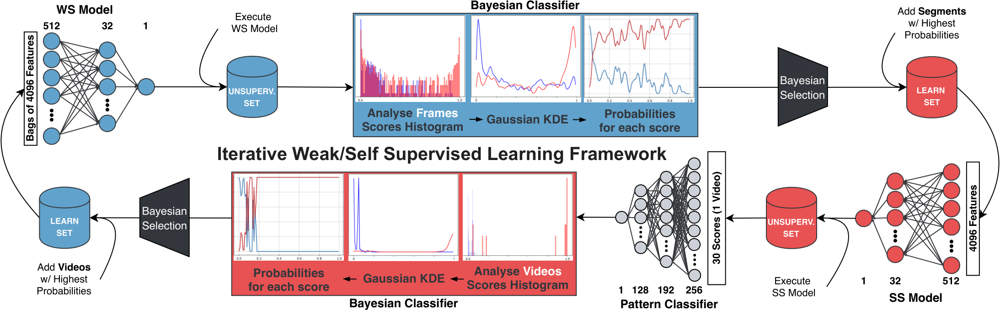

# Human Activity Analysis: Iterative Weak/Self-Supervised Learning Frameworks for Detecting Abnormal Events

This repository contains the code for the IJCB'20 paper ["Human Activity Analysis: Iterative Weak/Self-Supervised Learning Frameworks for Detecting Abnormal Events"](http://socia-lab.di.ubi.pt/EventDetection)

<div align="center">
    
</div>


##### Libraries version:
* Keras: 2.4.3
* TensorFlow: 2.2.0
* Scipy: 1.4.1
* Scikit-learn: 0.21.3
* NumPy: 1.17.3


## Directory structure and datasets

[**UBI-Fights Dataset**](http://socia-lab.di.ubi.pt/EventDetection).\n
To train your model and employ self-supervision for each network, the following directory structure is created:

```
|-- annotation
|   |-- strong
|   |   |-- train.csv           // empty, to be filled by the WS Model and Bayesian Classifier
|   |   |-- test.csv
|   |   |-- val.csv
|   |   |-- unlabeled_set.csv
|   |   |-- test_notes.csv
|   |   `-- val_notes.csv
|   `-- weak
|       |-- train.csv           // Small percentage (like 30%) of the original training set, for self-supervision purposes
|       |-- test.csv
|       |-- val.csv
|       |-- unlabeled_set.csv
|       |-- test_notes.csv
|       `-- val_notes.csv
|-- models
|   |-- pattern_model
|   |   |-- 0                   // WSS framework iterations
|   |   |-- 1
|   |   |-- ...
|   |-- strong_model
|   |   |-- 0                   // WSS framework iterations
|   |   |-- 1
|   |   |-- ...
|   `-- weak_model
|       |-- 0                   // WSS framework iterations
|       |-- 1
|       |-- ...
`-- results         
    |-- pattern
    |   `-- VAL                 // Directory for validation stats
    |-- strong
    |   |-- FINAL               // Directory for test stats
    |   `-- VAL
    `-- weak
        |-- FINAL
        `-- VAL
    
```

## Citation
Please cite this paper in your publications if it helps your research:

    @inproceedings{degardin2020human,
      author = {Degardin, Bruno and Proença, Hugo},
      title = {Human Activity Analysis: Iterative Weak/Self-Supervised Learning Frameworks for Detecting Abnormal Events},
      booktitle={IEEE International Joint Conference on Biometrics},
      year = {2020},
      organization={IEEE}
    }

    
